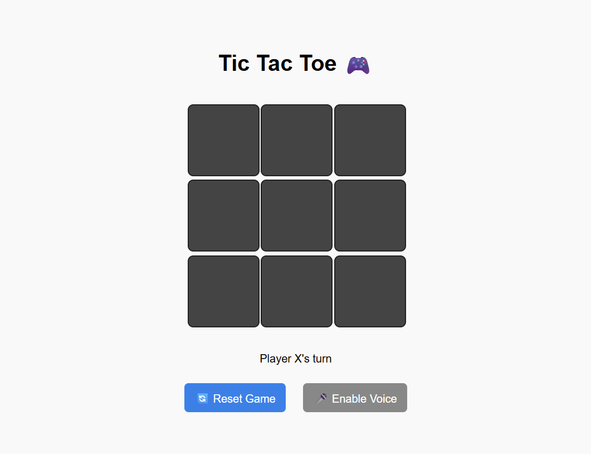

# 🎮 Tic-Tac-Toe Game

A simple web-based Tic-Tac-Toe game built using **HTML, CSS, and JavaScript**.  
Players can enjoy the classic 2-player game with sound effects for clicks, wins, and draws.  

---

## ✨ Features
- 🎲 Classic 3x3 Tic-Tac-Toe board  
- 🔊 Sound effects for moves, wins, and draws  
- 🎨 Simple and clean design with CSS  
- ⚡ Fast and responsive gameplay  

---

## 🛠️ Technologies Used
- **HTML** – for the game structure  
- **CSS** – for styling and layout  
- **JavaScript** – for game logic and interactivity  

---

## 🚀 Play the Game
👉 [Click here to play](https://Mohini0904.github.io/Tic-tac-toe/)  

---

## 📂 Project Setup
1. Clone this repository:  
   ```bash
   git clone https://github.com/Mohini0904/Tic-tac-toe.git


## 📸 Screenshot
